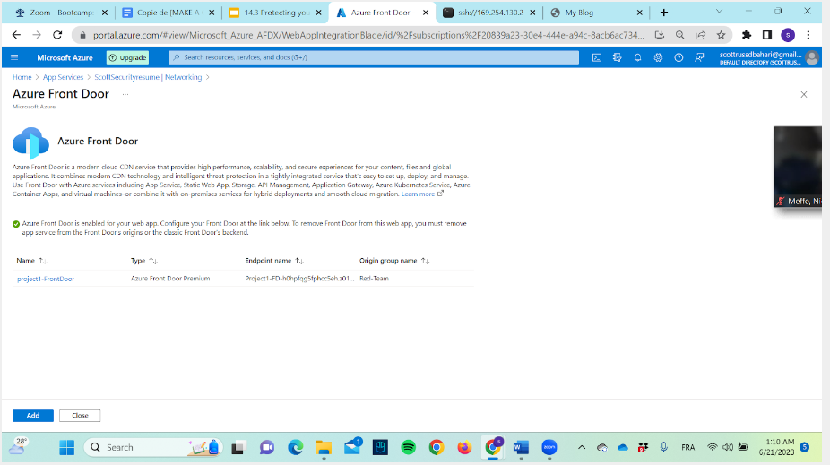
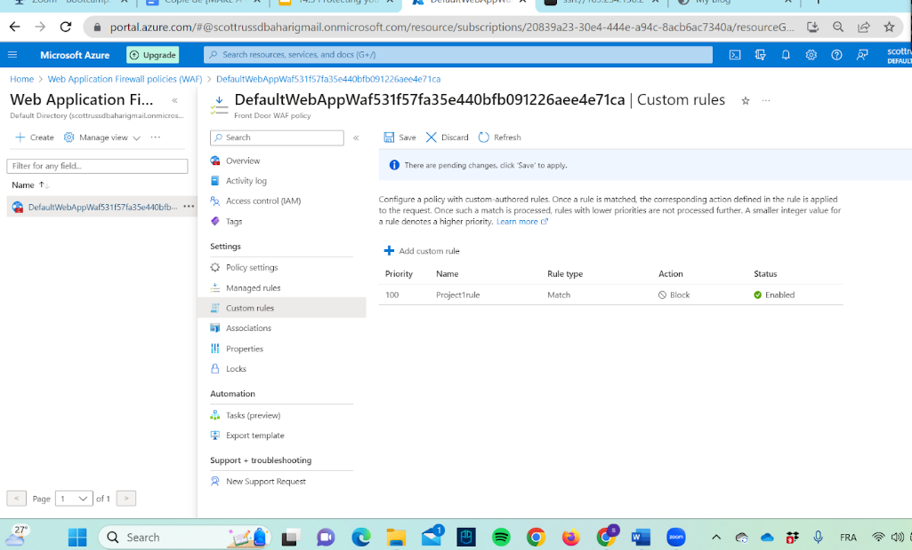

# Web-app-Project
Date Jun 2023
My first web application with common concept about cybersecurity

## Overview
Launching of my first web Application and its security to make it more user-friendly.

## Key Achievements
- Engineered and launched a web application on the Azure platform, troubleshooting deployment to ensure scalability and optimal user experience
- Amplified application security through the generation and integration of a self-signed SSL certificate, while managing cryptographic assets with Azure Key Vault
- Leveraged Azure Front Door to bolster web application delivery and security
- Reviewed and fine-tuned Web Application Firewall (WAF) rules, ensuring protection against prevalent web threats. Utilized Azure Security Center for threat detection and remediation

## Technologies Used
-Microsoft Azure Cloud

## Screenshots
https://scottsecurityresume.azurewebsites.net/
1) Deployment of the web Application through Azure Cloud with my own modifications of text and images

2) Implementation of Azure Front Door which is a service offered by Microsoft Azure that provides a wide ranges of features designed to secure the web application including global HTTP/HTTPS load balancing to manage the traffic within the Web Application, a WAF (Web application Firewall) to protect from common exploits and vulnerabilities, DDoS protection and many more...

3) Implementation of a WAF rule (Web Application Firewall rule) which is ensuring the protection of the Web Application such as blocking certain IP address to reach the Web Application with malicious intention or block common SQL injection or Cross-Site Scription (XSS). Many custom rules can be made through the WAF to secure the Web Application.

