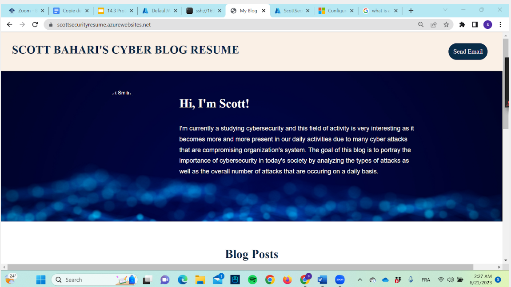
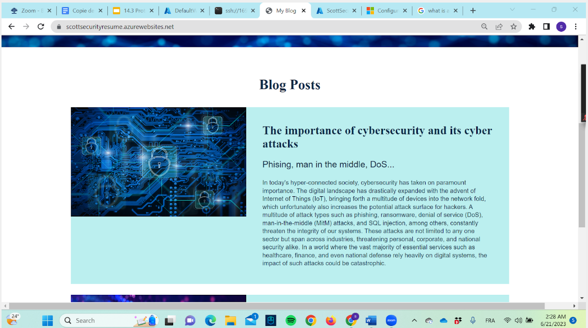
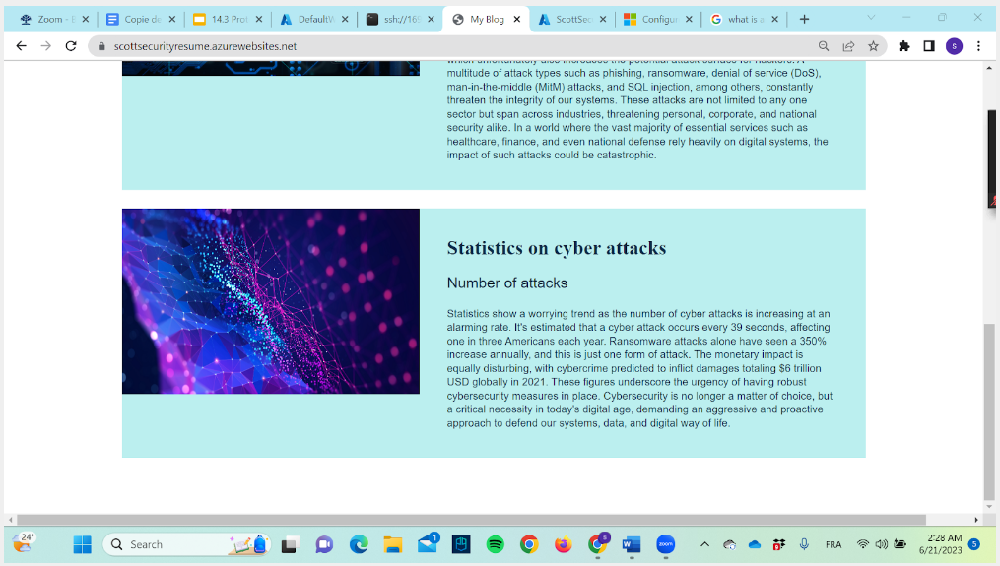

# Web-app-Project
Date Jun2023
My first web application with common concept about cybersecurity

## Overview
Launching of my first web Application and its security to make it more user-friendly.

## Key Achievements
- Engineered and launched a web application on the Azure platform, troubleshooting deployment to ensure scalability and optimal user experience
- Amplified application security through the generation and integration of a self-signed SSL certificate, while managing cryptographic assets with Azure Key Vault
- Leveraged Azure Front Door to bolster web application delivery and security
- Reviewed and fine-tuned Web Application Firewall (WAF) rules, ensuring protection against prevalent web threats. Utilized Azure Security Center for threat detection and remediation

## Technologies Used
-Microsoft Azure Cloud

## Screenshots
https://scottsecurityresume.azurewebsites.net/

